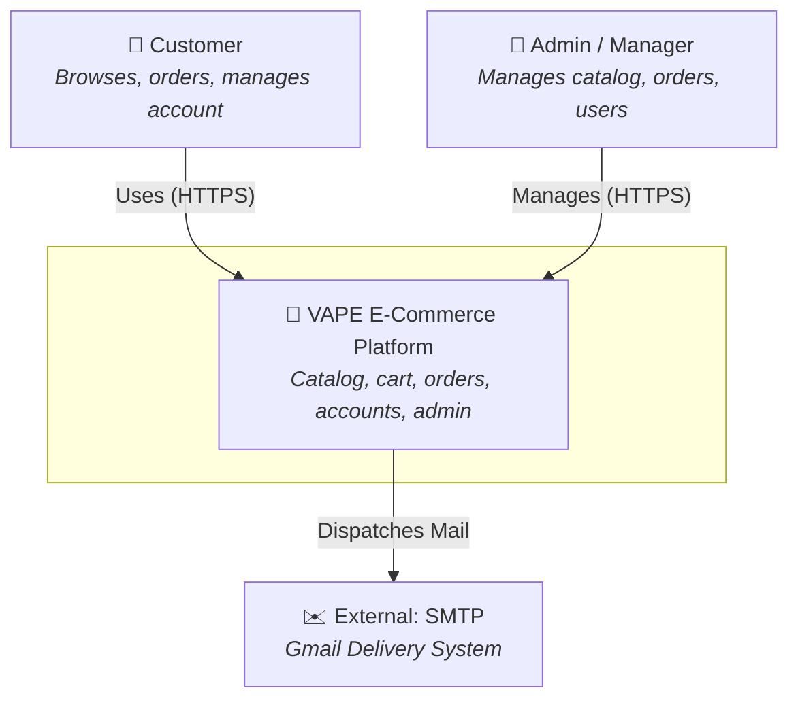
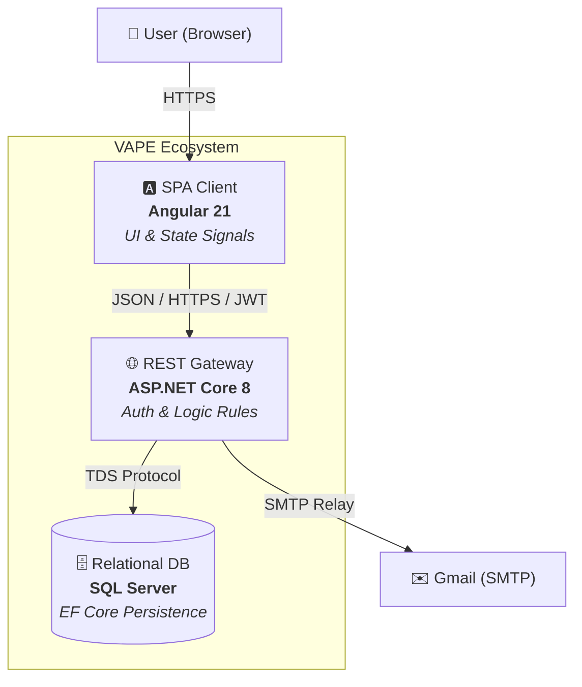
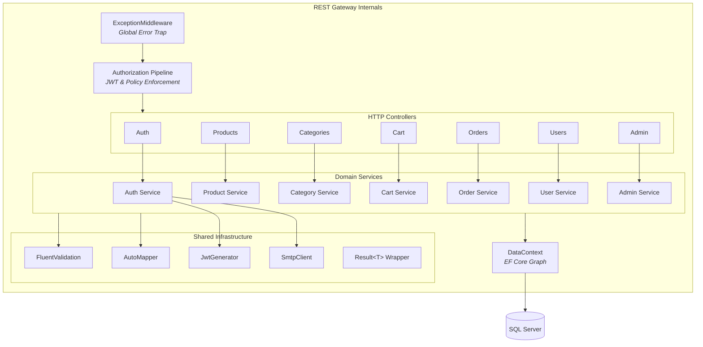
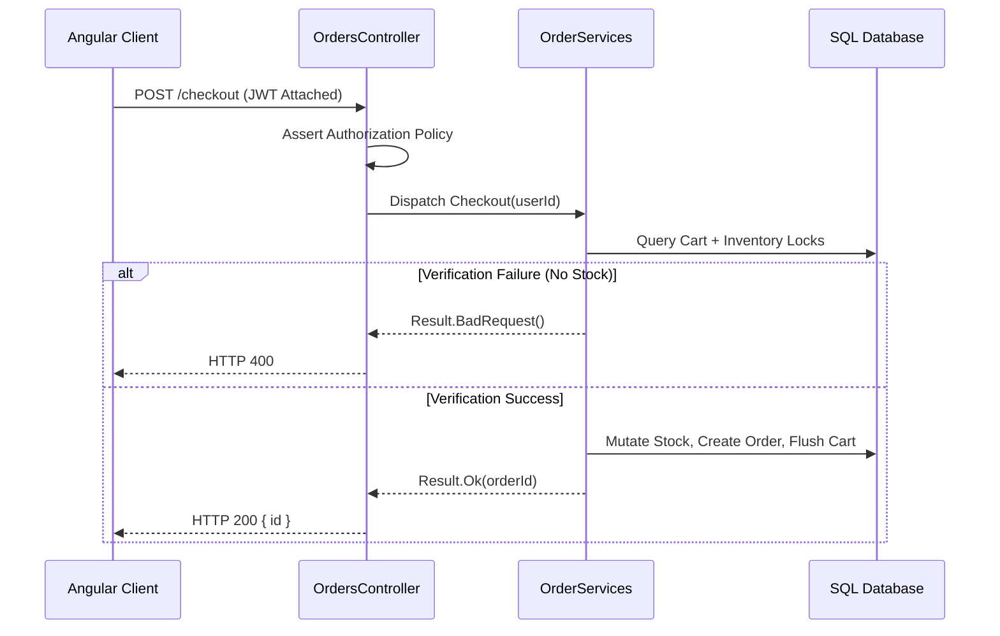
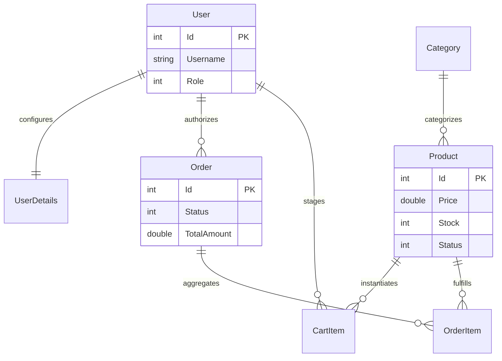

# 🏛️ VAPE — Architectural Blueprint (C4 Model)

> [!NOTE]
> This document maps the structural topology of the VAPE platform using the C4 hierarchy, progressing from systemic macro-contexts down to internal API composition.

---

## 🌐 Level 1: System Context

Defines the external actors and their boundaries relative to the VAPE platform.

---

## 📦 Level 2: Container Matrix

The logical deployment nodes and their communication vectors.

| Node | Technology | Primary Function |
|------|------------|------------------|
| **SPA Client** | Angular 21, RxJS | DOM rendering, route guarding, state hydration. |
| **REST Gateway** | ASP.NET Core 8 | Route controllers, data mapping, fluent validation. |
| **Relational DB**| SQL Server | Permanent state storage via EF Core mapping. |

---

## ⚙️ Level 3: Internal API Components

Internal dependency graph of the `.NET Core` REST Gateway.

---

## 🔄 Transaction Lifecycle: Checkout Sequence

---

## 💾 Relational Data Topography

> [!TIP]
> **Architectural Decisions:**
> 1. **Result Pattern**: Eliminates exception-driven flow control.
> 2. **Vertical Slice Services**: Forces thin controllers.
> 3. **Stateless JWT**: Completely decouples session memory from server instances.
