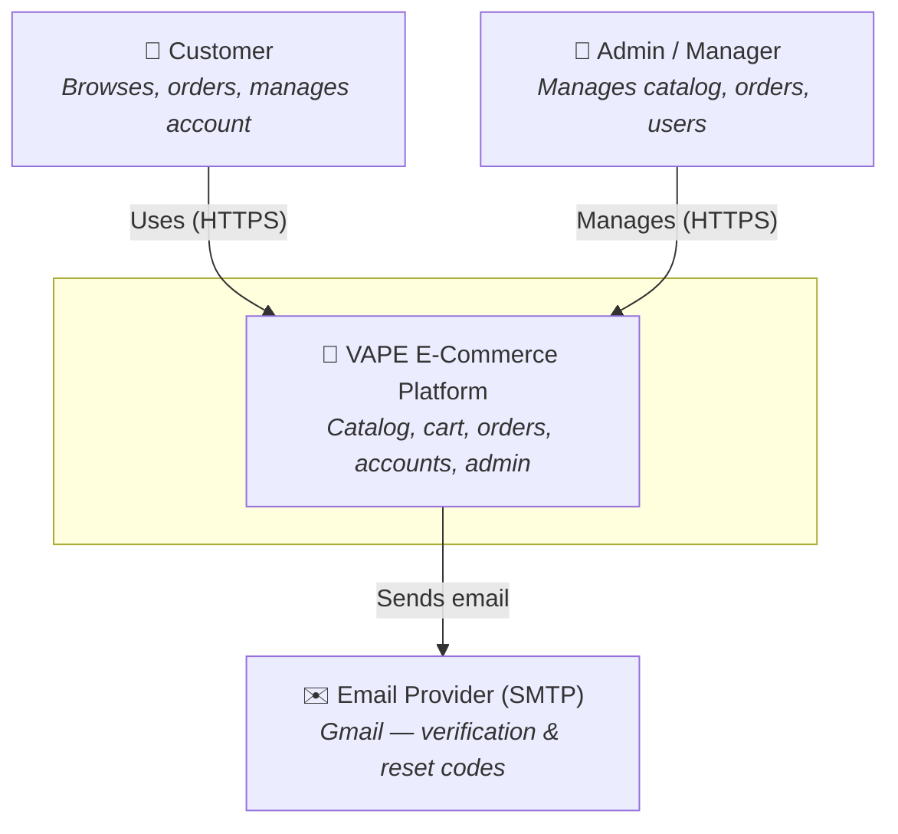
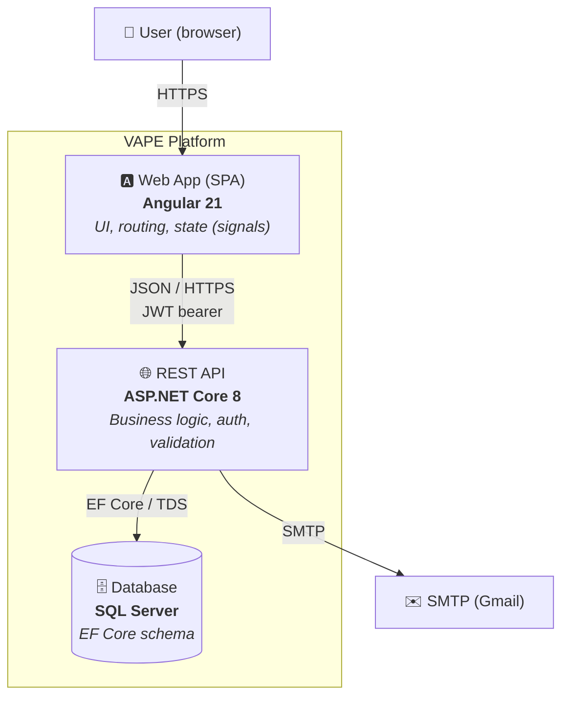
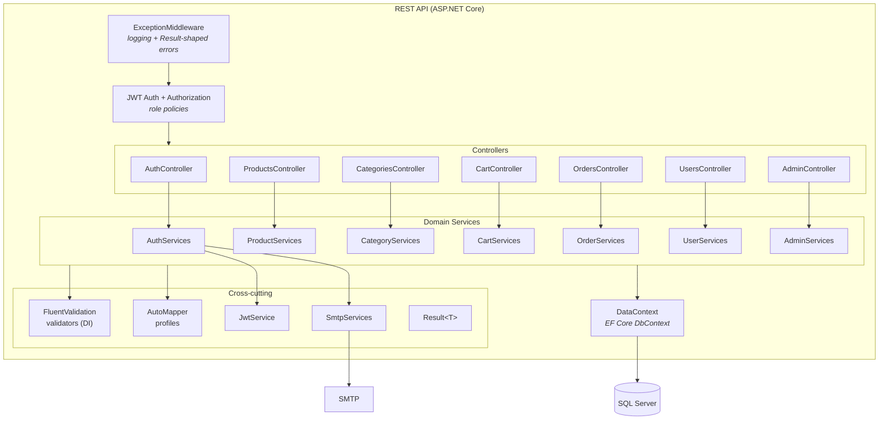
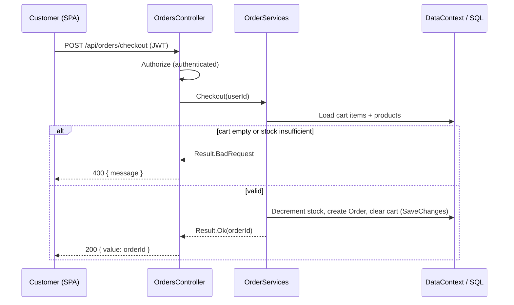
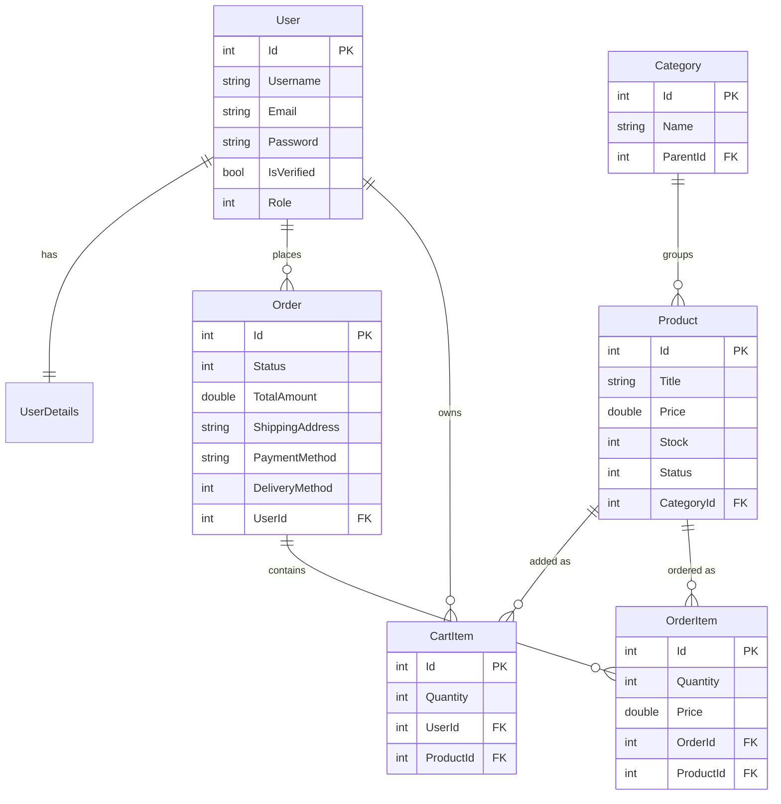

# VAPE — Architecture (C4 Model)

This document describes the architecture of the VAPE e-commerce platform using the
[C4 model](https://c4model.com/): a hierarchy of diagrams that zoom in from system
context, to containers, to the components inside the API.

Diagrams are written in [Mermaid](https://mermaid.js.org/) and render directly on
GitHub.

---

## Level 1 — System Context

Who uses VAPE and what it talks to.

**Actors**

- **Customer** — registers, verifies email, browses/searches products, manages a
  cart, places and tracks orders, edits their profile.
- **Admin / Manager** — staff who manage the catalog and orders; Admins also
  manage users and roles.

**External systems**

- **SMTP (Gmail)** — delivers email verification and password-reset codes.

---

## Level 2 — Containers

The deployable/runnable parts and how they communicate.

| Container | Tech | Responsibility |
|-----------|------|----------------|
| Web App (SPA) | Angular 21, RxJS, SCSS | Renders UI, guards routes, holds client state, attaches JWT to requests |
| REST API | ASP.NET Core 8 | Authentication/authorization, validation, business rules, persistence |
| Database | SQL Server + EF Core | Stores users, products, categories, carts, orders |
| SMTP | Gmail | Outbound transactional email |

Authentication is **stateless**: the API issues a JWT on login/verify; the SPA
stores it and sends it as a bearer token. Role claims in the JWT drive
authorization on both sides.

---

## Level 3 — Components (inside the REST API)

How the API is organized internally. Each request flows through a controller into
a domain service, which uses the `DbContext`, validators, and mappers.

### Component responsibilities

| Component | Responsibility |
|-----------|----------------|
| **ExceptionMiddleware** | Catches unhandled exceptions, logs them, returns a consistent 500 `Result` |
| **JWT Auth/Authorization** | Validates bearer tokens; enforces `Admin` / `Manager` role policies |
| **Controllers** | Thin HTTP layer; bind requests, call a service, map `Result.Status` → HTTP status |
| **Domain Services** | All business logic (one service per domain), the only layer touching `DataContext` |
| **FluentValidation validators** | Input validation, resolved via DI and invoked inside services |
| **AutoMapper profiles** | Entity → response DTO projection (incl. `ProjectTo` for queries) |
| **JwtService** | Issues signed JWTs with id/name/email/role claims |
| **SmtpServices** | Sends verification & reset emails; credentials from configuration/secrets |
| **Result\<T\>** | Uniform result/error envelope returned by services |
| **DataContext** | EF Core `DbContext`; entity sets and relationships |

---

## Request lifecycle (example: checkout)

---

## Data model

Core entities and their relationships.

> `OrderItem.Price` captures the unit price at purchase time, and `Order.TotalAmount`
> the order total at checkout, so historical orders are unaffected by later price
> changes. `Category.ParentId` provides an optional subcategory hierarchy, and
> `Product.Status` (Active/Inactive) hides products from the storefront without
> deleting them.

---

## Key architectural decisions

- **Layered, service-per-domain** — controllers stay thin; each domain has a
  single service that owns its business rules and is the only caller of EF.
- **`Result<T>` over exceptions for flow control** — predictable status codes and
  a uniform response envelope; exceptions are reserved for the unexpected and
  handled centrally by middleware.
- **Stateless JWT auth** — no server session; role claims travel in the token and
  are enforced by both API policies and Angular guards.
- **Validation at the edge of services via DI** — FluentValidation validators are
  injected and run before business logic, returning structured errors.
- **InMemory-testable services** — services depend on `DataContext` + interfaces,
  enabling fast xUnit tests with the EF InMemory provider.
